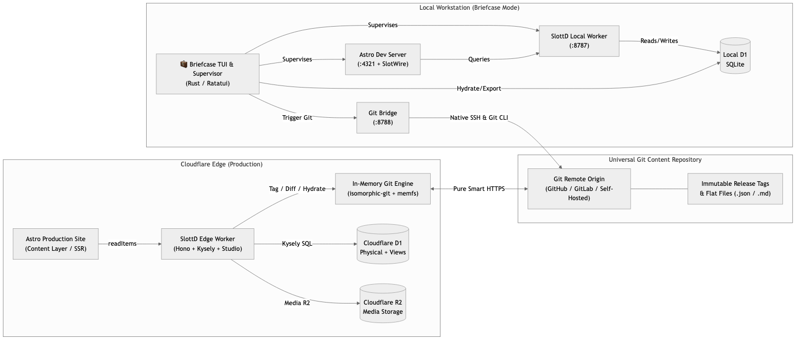

<div align="center">
  
  <h1>SlottD (<em>"Slotted"</em>)</h1>
  <p><strong>A fully online, edge-native micro-CMS deployed as a Cloudflare Worker on D1 and R2 — with universal Git synchronization and an optional native Briefcase workstation command center. Designed to slot into Astro and SlotWire.</strong></p>
</div>

[](https://opensource.org/licenses/MIT)
[](https://github.com/bmoelk/slottD)
[](https://workers.cloudflare.com/)
[](https://developers.cloudflare.com/d1/)
[](https://developers.cloudflare.com/r2/)
[](https://astro.build/)
[](https://github.com/bmoelk/slotwire)
[-DEA584?logo=rust&logoColor=white)](briefcase/)

> [!NOTE]
> **SlottD is currently in public alpha/beta.** APIs, database views, and synchronization protocols are actively evolving as we build out the SlotWire and Astro ecosystem. Feedback, issue reports, and contributions are warmly welcomed!

---

## 💡 What is SlottD?

**SlottD** is first and foremost a fully online, edge-native headless micro-CMS deployed directly to **Cloudflare Workers**, **D1**, and **R2**. It provides the lightweight data engine, query layer, and micro-studio needed to power modern headless websites built with **Astro** and edited in-context with **SlotWire**:

1. **Directus-Compatible REST Target**: Implements the filter, sort, and pagination query syntax expected by standard `@directus/sdk` and SlotWire's `DirectusAdapter` without running a multi-gigabyte Docker container.
2. **Hybrid Storage Engine (D1 + Relational Views)**: Stores routing identifiers (`slug`, `title`, `status`) physically for indexed lookups and SQLite uniqueness constraints, while custom fields and composite slots live in a JSON document column. Dynamic SQLite `VIEW`s surface clean relational SQL models with zero-downtime schema evolution.
3. **Universal Git Integration**: Treats Git as an open, decentralized content repository—providing immutable commit versioning, human-readable file exports, and cross-platform synchronization between edge Workers and local machines.
4. **Optional Briefcase Mode (Local Command Center)**: For developers who prefer an offline-first or terminal workflow, SlottD includes an optional companion Rust desktop TUI that supervises both the local SlottD CMS worker and the Astro development server simultaneously, providing local SQLite persistence and live page telemetry.
5. **Deep-Linkable Micro-Studio**: A server-rendered single-document editor using Alpine.js, Markdown with live preview, and Pell rich text with semantic `<textarea>` fallbacks, designed to deep-link directly from SlotWire in-situ badges.
6. **SlotWire In-Situ Synergy**: Supports live draft preview bypass (`slotwire_preview=true`), archetype badge integration, and pre-publish verification pipelines.

---

## 🏗 System Architecture

<div align="center">
  
  <p><em>Three-tier topology connecting local workstation, decentralized Git storage, and Cloudflare Workers edge. (<a href="assets/architecture.mmd">View Mermaid source</a>)</em></p>
</div>

---

## 🔄 Universal Git Integration: The Data Foundation

Traditional headless CMS systems often trap content inside proprietary databases, complicating backups, migrations, and multi-environment workflows. SlottD treats Git as a first-class content transport and versioning protocol, solving three fundamental data management needs:

### 1. Industry-Standard Content Versioning
- **Immutable Releases**: Every content publication can generate an annotated Git tag (`release-YYYY.MM.DD-HHMM`) containing complete document states.
- **Semantic Diffing**: Preview line-by-line differences between the active database and any historical Git release tag before loading changes.
- **Audit Verification**: Pre-publish verification reports (`content/.audit/verification-report.json`) are stored alongside releases, documenting contract check results and authors.

### 2. Transparent Backup, Export & Ingestion
- **Flat File Serialization**: D1 database records serialize to structured JSON and Markdown files (`content/<collection>/<slug>.json` or root collection folders).
- **Inspectable Anywhere**: Content remains readable and editable using any text editor or standard Git workflow, removing database lock-in.
- **Predictable Hydration**: Ingesting from Git reconciles records against D1 by `(collection, slug)` before insert or update, maintaining SQLite `UNIQUE` constraints and preserving existing record IDs.

### 3. Cross-Platform Coordination
- **Decentralized Transport**: Moves content between edge Cloudflare isolates, local development workstations, staging environments, and CI/CD pipelines without custom replication daemons.
- **Dual-Engine Implementation**:
  - **Edge Workers**: Uses `isomorphic-git` with in-memory `memfs` over pure Smart HTTP (HTTPS). Runs without Node.js binaries or vendor platform APIs.
  - **Workstation / Briefcase**: Uses `NativeShellGitDriver` with the host Git CLI and local `~/.ssh` keys/ssh-agent.
- **Isolated Scratch Extraction**: Local tag inspection and extraction use `git archive` into temporary scratch space, preventing uncommitted working tree files from being modified or discarded.

---

## 🧳 (Optional) Briefcase Mode: Local Workstation Command Center

While SlottD is engineered first and foremost as a fully online, edge-native micro-CMS deployed directly to Cloudflare Workers, **Briefcase mode is an optional companion workstation environment** for developers who want to run, test, and edit locally with zero cloud dependencies. Powered by the cross-platform mobility of SlottD's Git synchronization engine, Briefcase allows you to work completely offline, sync local edits to Git, and hydrate production Workers whenever you are ready.

```
  🧳 SlottD Briefcase — Local Edge CMS & Astro Development Command Center
┌─ Active Services, Paths & Telemetry ────────────────────────────────────────┐
│ SlottD CMS: 🟢 Running (PID: 74120, Port: 8787)  Path: /apps/cms            │
│ Astro Site: 🟢 Running (PID: 74122, Port: 4321)  Path: /apps/site           │
│ Telemetry:  ⚡ 42 CMS queries served (avg 0.8ms/query) | 📊 Page burst: 12  │
│ Page Route: 🏁 Page '/blog/post-1' rendered in 14.2ms                       │
│ Content DB: 128 documents (4 collections) | Git: ✅ Clean (Branch: main)     │
│ Quick Link: [O] Studio: :8787/admin  |  [W] Site: :4321  |  Git Bridge: :8788│
└─────────────────────────────────────────────────────────────────────────────┘
┌─ Select Log View ([1], [2], [3] or [Tab]) ──────────────────────────────────┐
│ [1] SlottD CMS Logs    [2] Astro Site Logs    [3] Git Content Status        │
└─────────────────────────────────────────────────────────────────────────────┘
```

### Key Briefcase Capabilities

* **Native Rust Implementation**: Built with `ratatui`, `crossterm`, `rusqlite`, and `keyring` in the `briefcase/` workspace. Starts immediately with minimal system overhead.
* **Dual Process Supervision**: Concurrently manages the SlottD CMS Worker (`wrangler dev` on port `8787`) and the Astro website dev server (`astro dev` on port `4321`), with coordinated lifecycle management and clean termination.
* **Local D1 SQLite Persistence**: Connects directly to Miniflare's local SQLite database file (`.wrangler/state/v3/d1/...`), providing local query responses.
* **Live Telemetry & Burst Tracking**: Monitors query counts, average query execution times, page query burst boundaries, and route transitions in real time.
* **Embedded Native Git Bridge (Port 8788)**: Runs a background HTTP server that allows the browser-based Studio UI (`/admin/git`) to trigger native host Git and SSH operations locally without requiring personal access tokens.
* **OS Keyring Integration**: Securely retrieves and sets administrative credentials through the native OS keyring (Apple Keychain, Windows Credential Manager, Linux Secret Service), eliminating plaintext secret storage.
* **Desktop UI Roadmap**: A dedicated native **Tauri desktop application** is on the roadmap to complement the terminal TUI and browser-based Studio.

### Briefcase Hotkeys

| Hotkey | Action |
| :--- | :--- |
| `[O]` | Open SlottD Studio in default browser (`http://localhost:8787/admin`) |
| `[W]` | Open Astro website in default browser (`http://localhost:4321`) |
| `[/]` | Filter logs in real time with interactive text search |
| `[Z]` | Toggle full-height log view (zoom mode) |
| `[1]` / `[2]` / `[3]` | Switch log stream between CMS, Astro Site, and Git status |
| `[Tab]` | Cycle forward through log views |
| `[↑]` / `[↓]` / `[PgUp]` / `[PgDn]` | Scroll active log buffer (press `[G]` or `[End]` to resume auto-follow) |
| `[E]` | Export active D1 database records to flat Git repository files |
| `[L]` | Open release tag picker modal to restore and hydrate D1 from Git |
| `[Q]` / `[Esc]` | Gracefully stop all supervised processes and exit |

---

## 📦 Storage Model: Physical SQLite + Dynamic Relational Views

To avoid complex `ALTER TABLE` operations on SQLite, SlottD employs a hybrid architecture:

### 1. The Physical Table (`documents`)
Maintains database-level uniqueness on slugs and indexed lookups:

```sql
CREATE TABLE documents (
  id TEXT PRIMARY KEY,
  collection TEXT NOT NULL,
  slug TEXT NOT NULL,
  title TEXT NOT NULL,
  status TEXT NOT NULL DEFAULT 'draft', -- 'draft' | 'scheduled' | 'published' | 'archived'
  schema_version INTEGER NOT NULL DEFAULT 1,
  data JSON NOT NULL,
  draft_data JSON,                      -- Isolated working copy for uncommitted edits
  draft_status TEXT DEFAULT 'none',    -- 'none' | 'modified' | 'new'
  draft_updated_at INTEGER,
  publish_at INTEGER,
  created_at INTEGER NOT NULL,
  updated_at INTEGER NOT NULL,
  UNIQUE(collection, slug)
);

CREATE INDEX idx_docs_collection_slug ON documents(collection, slug);
CREATE INDEX idx_docs_collection_status ON documents(collection, status);
```

### 2. Dynamic Relational Views (`CREATE VIEW`)
Field schemas are expressed as SQLite views querying the underlying JSON store. Updating schemas modifies the view definition without altering disk tables:

```sql
CREATE VIEW posts AS
SELECT 
  id,
  collection,
  slug,
  title,
  status,
  json_extract(data, '$.body') AS body,
  json_extract(data, '$.cover_image') AS cover_image,
  json_extract(data, '$.author_id') AS author_id,
  json_extract(data, '$.features') AS features,
  created_at,
  updated_at
FROM documents
WHERE collection = 'posts';
```

---

## 🖼 Descriptive Media Storage (R2 + Dual Key Resolution)

SlottD enforces human-readable object keys in Cloudflare R2 while preserving compatibility with Directus UUID standards:

1. **Descriptive R2 Keys**: Uploaded assets use sanitized, human-readable keys (e.g. `hero-banner.png`, `author-avatar.jpg`) rather than opaque UUIDs. If collisions occur, a deterministic short suffix is added (`hero-banner-4x9a.png`).
2. **Bi-Directional Mapping in D1**: The `media` table maintains the relationship:
   - `id`: UUID (compatible with Directus SDK)
   - `key`: Human-readable storage key (for direct CDN delivery)
   - `filename`, `mime_type`, `size`, `created_at`
3. **Flexible Retrieval**: Files can be requested by either UUID or descriptive key:
   - `GET /files/:idOrKey`
   - `GET /assets/:idOrKey`

---

## ⚡ Lean Micro-Studio UI (Zero-Build Standard)

The SlottD Studio UI operates without client-side framework runtimes or frontend bundling steps:

* **Server-Rendered HTML**: Views are rendered on-demand via `hono/html` inside the Cloudflare Worker isolate.
* **Offline-Resilient Micro-Libraries**: Alpine.js is vendor-served directly from the Worker (`/admin/vendor/alpine.js`) for reactive UI state, modals, tabs, and clipboard helpers.
* **Markdown & Rich Text**: Includes a responsive Markdown editor with live preview and a lightweight Pell rich text editor, both designed with semantic HTML `<textarea>` fallbacks if scripts are blocked.
* **Dual-State Editing**: Edits are stored in `draft_data` without overwriting published content. Authors can view visual side-by-side diffs, revert changes, or promote drafts atomically.

---

## 🧭 Directus API Compatibility & `/ext/*` Namespacing

SlottD implements standard Directus REST endpoints alongside an extended operations namespace:

### Core Directus Protocol
* `GET /items/:collection`: Filter, sort, limit, offset, and field selection querying.
* `GET /items/:collection/:id`: Single record retrieval.
* `POST /items/:collection`: Create record (requires authentication).
* `PATCH /items/:collection/:id`: Update record (requires authentication).
* `DELETE /items/:collection/:id`: Delete record (requires authentication).
* `GET /files/:idOrKey` & `GET /assets/:idOrKey`: Media streaming by UUID or descriptive key.
* `GET /activity`: Directus-compatible revision and activity log feed.

### Extended Engine Endpoints (`/ext/*`)
* `POST /ext/release/publish`: Atomically promotes working draft copies to published documents and triggers registered hooks.
* `POST /ext/sync/hydrate`: Ingests and reconciles records from a Git repository or tag into D1.
* `POST /ext/sync/export`: Serializes active D1 database records into disk-ready flat files.
* `GET /ext/briefcase/status`: Reports health and connectivity status of the local Briefcase bridge.
* `POST /ext/bundle/validate`: Runs pre-publish verification pipelines and contract validation.

---

## 🔌 SlotWire & Astro Integration

### 1. Astro Content Layer Loader (`src/lib/cms.ts`)
Use `@directus/sdk` with standard REST requests:

```typescript
import { createDirectus, rest, readItems } from '@directus/sdk';

export const cms = createDirectus(import.meta.env.SLOTTD_API_URL).with(rest());

export async function getBlogPosts(preview = false) {
  return await cms.request(
    readItems('posts', {
      filter: {
        status: { _eq: preview ? 'draft' : 'published' },
      },
      sort: ['-created_at'],
    })
  );
}
```

### 2. SlotWire Configuration (`slotwire.config.ts`)
Connect SlotWire using the built-in Directus provider to route in-situ clicks to the SlottD Studio:

```typescript
import { defineConfig } from '@slotwire/core';

export default defineConfig({
  provider: 'directus',
  adminUrl: 'https://cms.yourdomain.com/admin',
  // SlotWire automatically links in-situ clicks to:
  // https://cms.yourdomain.com/admin/content/:collection/:id
});
```

### 3. Dynamic Preview Bypass
When the `slotwire_preview=true` cookie is present, Astro bypasses build-time caches (`cache: 'no-store'`) to display draft content directly from SlottD.

---

## 🛡 Pre-Publish Verification Pipeline

SlottD provides a uniform contract for pre-publish lifecycle checks:

```typescript
export interface HookResult<T = any> {
  status: 'ok' | 'warning' | 'error';
  message?: string;
  data?: T;
}
```

Example configuration (`slottd.config.ts`):

```typescript
import { slotwireContractCheck, terminologyCheck } from 'slottd/checks';
import type { SlottdConfig } from 'slottd';

export const config: SlottdConfig = {
  hooks: {
    onBeforePublish: async (ctx) => {
      return runCheckPipeline([
        // Verify schema contracts with SlotWire endpoint
        slotwireContractCheck({
          endpoint: 'https://edit.yourdomain.com/api/slotwire/validate',
        }),
        // Terminology check
        terminologyCheck({
          flaggedTerms: ['deprecated-term', 'internal-only'],
          severity: 'error',
        }),
      ], ctx);
    },
  },
};
```

---

## 📊 Environment Feature Matrix

| Feature | Pure Edge D1 (Primary Online) | Git-Enhanced Edge (Primary Online) | Briefcase Mode (Optional Local) |
| :--- | :--- | :--- | :--- |
| **Storage Engine** | Cloudflare D1 | Cloudflare D1 | Local Miniflare SQLite |
| **Studio UI** | Cloudflare Worker | Cloudflare Worker | Local Worker (:8787) |
| **Working Copies (`draft_data`)** | SQLite | SQLite | SQLite |
| **SlotWire In-Situ Bridge** | Supported | Supported | Supported |
| **Process Supervision** | Cloudflare Edge | Cloudflare Edge | Dual Supervisor (:8787 + :4321) |
| **Live Page Telemetry** | — | — | Query counts, latency ms, bursts |
| **Version History** | SQLite activity table | SQLite + Git commit history | SQLite + Native Git CLI / SSH |
| **Disaster Recovery** | SQLite backups | 1-click restore from Git tag | 1-click restore from Git tag |
| **Offline Development** | — | — | Fully operational offline |

---

## 🚀 Quick Start

### Option A: Edge Worker Deployment (Primary Online Workflow)
Run and deploy SlottD as a Cloudflare Worker:

```bash
# Clone the repository
git clone https://github.com/bmoelk/slottD.git
cd slottD
npm install

# Start local Miniflare edge worker
npm run dev

# Apply D1 migrations locally or to remote production
npm run db:migrate:local
npm run db:migrate:remote

# Deploy to Cloudflare Workers
npm run deploy:prod
```

### Option B: (Optional) Briefcase Mode (Local Workstation)
If you prefer an all-in-one local desktop environment supervising both SlottD and Astro:

```bash
# Apply local migrations
npm run db:migrate:local

# Start the native Briefcase TUI & dual supervisor
npm run briefcase
# Or run directly via Cargo:
# cargo run --manifest-path briefcase/Cargo.toml
```

### Option C: CLI Subcommands (Headless Scripting)
The Briefcase binary also runs non-interactively in CI/CD or automation scripts:

```bash
# Export active D1 database records to flat files
cargo run --manifest-path briefcase/Cargo.toml -- export

# Restore D1 from a specific release tag
cargo run --manifest-path briefcase/Cargo.toml -- restore --tag release-2026.09.14-1000

# Snapshot, create Git release tag, and push via SSH
cargo run --manifest-path briefcase/Cargo.toml -- release --tag release-v1.2.0 --message "Content update"
```

---

## 🔄 Upgrading Installed CMS Instances (Tier 2 Upgrade Protocol)

When SlottD releases new features, bug fixes, or database migrations, downstream CMS instances (e.g. `websites-cms`) upgrade cleanly using a disciplined **3-Step Protocol**:

```
Step 1: Code Upgrade ──► Step 2: D1 Migration ──► Step 3: Verification & Deploy
  npm update slottd        npm run db:migrate        npm test && npm run deploy:prod
```

### 1. Update the Dependency (`package.json`)
Depending on your release tracking method:
* **Via Tagged Release (Recommended)**:
  ```bash
  npm install github:bmoelk/slottD#v0.3.0
  ```
* **Via Active Branch**:
  ```bash
  npm update slottd
  # Or force re-resolving latest commit:
  npm install github:bmoelk/slottD#feature/multisite
  ```

### 2. Apply Database Migrations (`db:migrate`)
If the release includes schema additions (such as `0004_multisite.sql`):
```bash
# Local Miniflare / Briefcase D1
npm run db:migrate:local
# Runs: wrangler d1 migrations apply DB --local

# Production Remote D1 (Cloudflare)
npm run db:migrate:remote
# Runs: wrangler d1 migrations apply DB --remote -c wrangler.overrides.toml
```

> **Zero Content Loss Guarantee**: SlottD migrations are strictly additive (Rule 5 schema versioning). Existing documents, media, and versions are never overwritten or deleted.

### 3. Verify & Deploy
```bash
# Run local verification
npm run type-check
npm test

# Deploy to Cloudflare Workers
npm run deploy:prod
```

### Safety Net & Rollback
* **Instant Revert**: Downgrade anytime via `npm install github:bmoelk/slottD#<previous-tag>`.
* **Disaster Recovery**: Content is perpetually stored in your Git content repositories (`/websites-git-repos/*`). If a database is ever corrupted, `npm run sync:hydrate` re-populates D1 in seconds.

---

## 📜 License

MIT License. Developed for the SlotWire and Astro communities.
