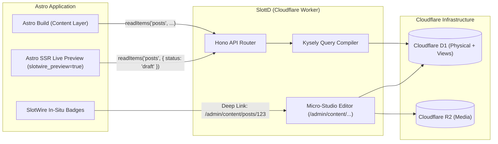

<div align="center">
  
  <h1>SlottD (*"Slotted"*)</h1>
  <p><strong>The ultra-lightweight, edge-native micro-CMS built for Cloudflare Workers, D1, and R2 — designed to slot directly into Astro and SlotWire.</strong></p>
</div>

[](https://opensource.org/licenses/MIT)
[](https://workers.cloudflare.com/)
[](https://developers.cloudflare.com/d1/)
[](https://astro.build/)
[](https://github.com/bmoelk/slotwire)

---

## 💡 What is SlottD?

**SlottD** is an edge-native data engine and micro-studio that provides the exact subset of capabilities needed to power modern headless websites built with **Astro** and edited in-context with **SlotWire**:

1. **Directus-Compatible REST Target**: Implements the filter/sort/pagination query syntax expected by standard `@directus/sdk` and SlotWire's `DirectusAdapter` — without the multi-gigabyte Docker monolith.
2. **Hybrid Storage Engine (D1 + SQLite Views)**: Stores universal routing columns (`slug`, `title`, `status`) physically for instant indexing and uniqueness guarantees, while keeping custom fields and composite slots in an indestructible JSON document store. Dynamic SQLite `VIEW`s surface clean relational SQL models with zero-downtime schema evolution.
3. **Kysely Query Engine**: Type-safe, parameterized dynamic query builder with zero SQL injection risk and sub-millisecond edge latency.
4. **Deep-Linkable Micro-Studio**: A lightweight, server-rendered single-document editor with embedded **Toast-UI** (Markdown), **Trix** (Rich Text), and **Composite Repeater** widgets that deep-link directly from SlotWire's visual badges.
5. **Bi-Directional Git Bridge**: Supports both D1-first live editing and Git-backed (Keystatic/Markdown) workflows, with automatic export to Git and one-command restoration (`slottd sync --from-git`).

---

## 🏗 System Architecture



---

## 📦 Storage Model: The Best of Both Worlds

Traditional headless CMSs on SQLite struggle with `ALTER TABLE` schema migrations. SlottD solves this with a hybrid architecture:

### 1. The Physical Table (`documents`)
Guarantees database-level uniqueness on slugs and blazing-fast index lookups:

```sql
CREATE TABLE documents (
  id TEXT PRIMARY KEY,
  collection TEXT NOT NULL,
  slug TEXT NOT NULL,
  title TEXT NOT NULL,
  status TEXT NOT NULL DEFAULT 'draft', -- 'draft' | 'published' | 'archived'
  data JSON NOT NULL,
  created_at INTEGER NOT NULL,
  updated_at INTEGER NOT NULL,
  UNIQUE(collection, slug)
);

CREATE INDEX idx_docs_collection_slug ON documents(collection, slug);
CREATE INDEX idx_docs_collection_status ON documents(collection, status);
```

### 2. Dynamic Relational Views (`CREATE VIEW`)
AI or developers define model schemas as lightweight SQLite views. Adding or modifying columns never alters disk tables—it simply drops and recreates the view in `< 0.1ms`:

```sql
CREATE VIEW posts AS
SELECT 
  id,
  collection,
  slug,
  title,
  status,
  json_extract(data, '$.body') AS body,
  json_extract(data, '$.cover_image') AS cover_image,
  json_extract(data, '$.author_id') AS author_id,
  json_extract(data, '$.features') AS features,
  created_at,
  updated_at
FROM documents
WHERE collection = 'posts';
```

---

## 🔌 SlotWire & Astro Content Layer Integration

### 1. In Astro (`src/lib/cms.ts`)
Use the official `@directus/sdk` with zero modifications:

```typescript
import { createDirectus, rest, readItems } from '@directus/sdk';

export const cms = createDirectus(import.meta.env.SLOTTD_API_URL).with(rest());

// In Astro Content Layer Loader:
export async function getBlogPosts(preview = false) {
  return await cms.request(
    readItems('posts', {
      filter: {
        status: { _eq: preview ? 'draft' : 'published' },
      },
      sort: ['-created_at'],
    })
  );
}
```

### 2. SlotWire Contract Bridge
Configure SlotWire to use its built-in `directus` provider:

```typescript
import { defineConfig } from '@slotwire/core';

export default defineConfig({
  provider: 'directus',
  adminUrl: 'https://cms.yourdomain.com/admin',
  // SlotWire automatically routes in-situ clicks to:
  // https://cms.yourdomain.com/admin/content/:collection/:id
});
```

---

## 🔄 Bi-Directional Git Sync

SlottD bridges the gap between fast edge databases and Git-backed workflows:

* **Restore from Git $\rightarrow$ D1**:
  ```bash
  npx slottd sync --from-git
  ```
  Parses markdown/JSON content files from your repository and seeds the D1 database in seconds.
* **Export D1 $\rightarrow$ Git**:
  Extracts published records from D1 and serializes clean markdown frontmatter files to commit back to Git history.

---

## 🚀 Quick Start (Coming Soon)

```bash
# Clone and install
git clone https://github.com/bmoelk/slottD.git
cd slottD
npm install

# Apply initial D1 migration
npx wrangler d1 migrations apply DB --local

# Start development worker
npm run dev
```

---

## 📜 License

MIT License. Designed with ❤️ for the SlotWire and Astro communities.
